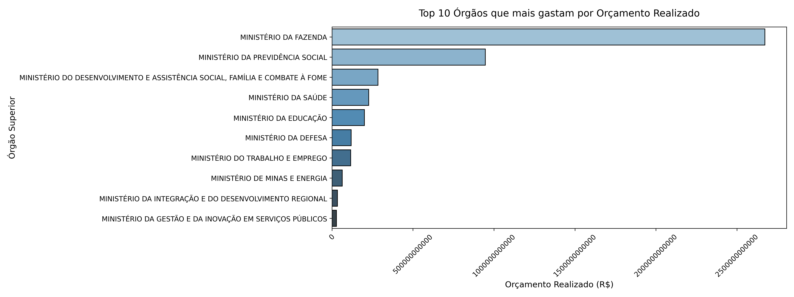
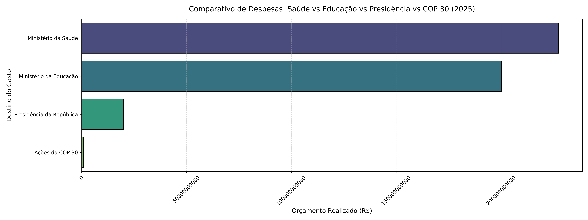
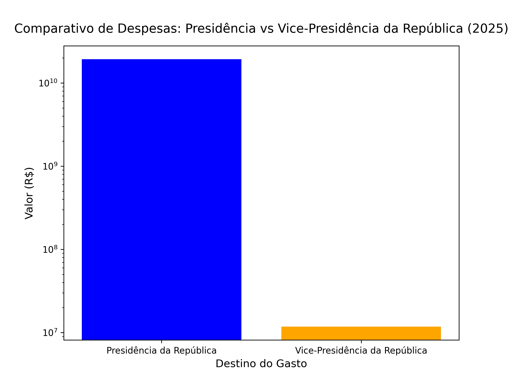

# 📊 Análise de Despesas Orçamentárias (2025)

Este projeto realiza a extração, tratamento, limpeza e análise visual de dados públicos referentes às despesas orçamentárias federais previstas e realizadas no ano de 2025. 

O objetivo principal é identificar a distribuição dos recursos públicos e gerar insights claros sobre os gastos governamentais através de diferentes níveis de agrupamento.

---

## 🛠️ Tecnologias e Ferramentas Utilizadas

* **Python 3** (Linguagem base)
* **Pandas** (Tratamento de dados, conversão de tipos e agregações)
* **Matplotlib & Seaborn** (Criação de gráficos e estilização visual das análises)
* **Jupyter Notebook** (Ambiente de desenvolvimento e prototipagem)
* **Git & GitHub Desktop** (Controle de versão e publicação do projeto)

---

## 🧼 Etapas do Tratamento de Dados (Data Cleaning)

Antes de gerar as visualizações, os dados brutos passaram por uma esteira rigorosa de limpeza para garantir a confiabilidade das informações:
1. **Padronização de Texto:** Conversão das colunas categóricas (como nomes dos órgãos) para letras maiúsculas para evitar contagens duplicadas por diferença de grafia.
2. **Remoção de Duplicatas:** Eliminação de linhas idênticas que pudessem distorcer a soma final.
3. **Conversão de Moeda (String para Float):** Remoção de pontos e substituição de vírgulas nos valores monetários (ex: de `0,00` para `0.00`).
4. **Tratamento de Anomalias (`pd.to_numeric`):** Uso do parâmetro `errors='coerce'` para converter hífens, espaços em branco ou textos inválidos em valores nulos (`NaN`) com segurança, impedindo a interrupção dos cálculos.

---

## 📈 Insights e Visualizações

### 1. Órgãos com Maiores Gastos (Top 10)
A primeira análise focou em agrupar as despesas por ministérios e secretarias (`NOME ÓRGÃO SUPERIOR`) para somar o **Orçamento Realizado**. 

Para melhorar a leitura de nomes longos e números na casa dos bilhões, as barras foram projetadas na horizontal e o eixo X foi configurado sem notação científica (formato plano):



---

### 2. Análise Temática e Sazonal (Saúde, Educação, Presidência vs. COP 30)
Para além dos grandes blocos fixos, foi realizada uma filtragem por palavras-chave com strings para isolar e comparar pastas estratégicas e eventos sazonais de grande relevância, como as despesas ligadas à **COP 30** [INDEX]. 

As linhas de grade verticais auxiliam na leitura dos valores e na comparação direta do peso orçamentário de cada setor:



---

### 3. Comparativo Institucional: Presidência vs. Vice-Presidência da República
Uma análise fina focada nos órgãos subordinados do núcleo do poder executivo (`NOME ÓRGÃO SUBORDINADO`). Devido à enorme disparidade na ordem de grandeza entre os gastos da Presidência e da Vice-Presidência, foi aplicada uma **escala logarítmica (`yscale('log')`)** no eixo Y. 

Essa técnica estatística permitiu a comparação visual direta entre os dois órgãos sem que a barra de menor valor ficasse invisível no gráfico:



---

## 📁 Estrutura do Repositório

```text
├── dados/
│   └── bruto/
│       └── 2025_OrcamentoDespesa_semduplicatas.csv  # Base tratada
├── analise_inicial.ipynb                             # Notebook com o código
├── top10_gastos.png                                  # Gráfico 1: Maiores gastos
├── comparativo_gastos_especificos.png                # Gráfico 2: Recorte temático / COP 30
├── comparativo_presidencia_vice.png                  # Gráfico 3: Escala logarítmica
├── requirements.txt                                  # Dependências do projeto
└── README.md                                         # Documentação principal
```

---

## 🚀 Como Executar o Projeto

1. Clone o repositório:
   ```bash
   git clone https://github.com
   ```
2. Crie e ative seu ambiente virtual (`venv`).
3. Instale as dependências necessárias:
   ```bash
   pip install -r requirements.txt
   ```
4. Abra o Jupyter Notebook e execute as células de `analise_inicial.ipynb`.

---
💡 *Este é o meu primeiro projeto focado em Análise de Dados Pública! Feedbacks e sugestões são sempre muito bem-vindos.*
